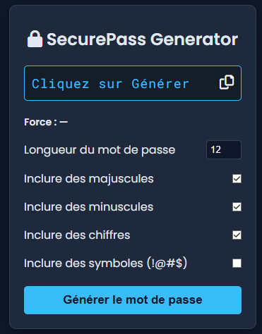

# 🔐 SecurePass Generator

SecurePass Generator est un générateur de mots de passe sécurisé développé en **HTML, CSS et JavaScript Vanilla**.

Ce projet a pour objectif de proposer des mots de passe robustes tout en mettant en pratique les bonnes pratiques de développement front-end.

---

## 🚀 Fonctionnalités

- Longueur du mot de passe personnalisable
- Inclusion des :
  - Majuscules
  - Minuscules
  - Chiffres
  - Symboles
- Génération aléatoire équilibrée
- Copie rapide dans le presse-papiers
- Indicateur de force (Faible / Moyenne / Forte)
- Interface moderne inspirée cybersécurité

---

## 🛠️ Technologies utilisées

- **HTML5**
- **CSS3**
- **JavaScript (Vanilla)**

Aucune librairie externe côté JavaScript.

---

## 📂 Structure du projet

---

## ▶️ Utilisation

1. Choisir la longueur du mot de passe
2. Sélectionner les types de caractères souhaités
3. Cliquer sur **"Générer le mot de passe"**
4. Copier le mot de passe généré en un clic

---

## 🔒 Sécurité

Les mots de passe générés respectent les critères de complexité standards.
Ce projet est destiné à un usage pédagogique et ne remplace pas un gestionnaire de mots de passe professionnel.

---

## 📸 Aperçu

---

## 👨‍💻 Auteur

Développé par **[loghanmrsn]**

---

## 📄 Licence

Projet libre à des fins éducatives.
